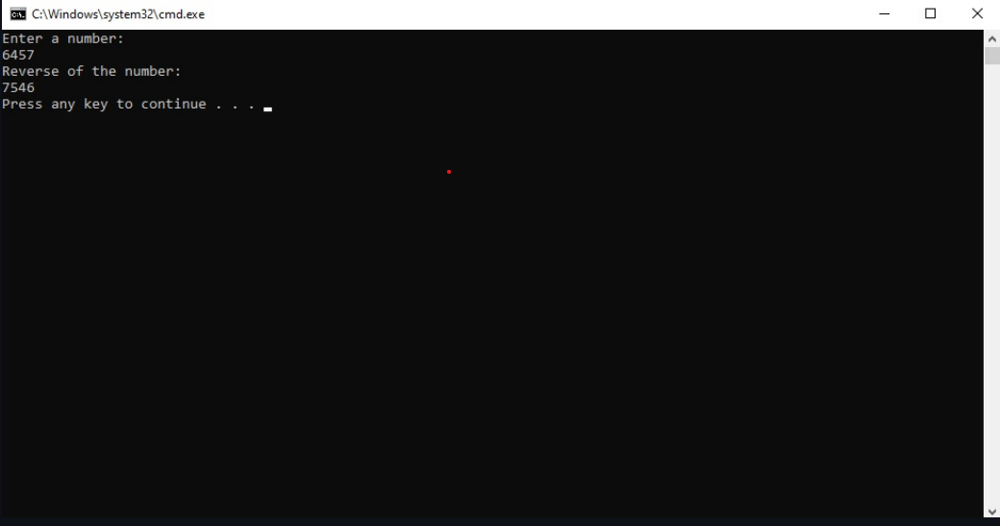

# Recursive-function

##Aim:
To write a C# program to reverse a number using recursive function.

##Algorithm:
Step1:

Create a function for reversing.

Step2:

Get the number from the user.

Step3:

In the function find reminder of the number and multiply it by 10 and add the reverse number.

Step4:

Recusively call this function to get the reversed number.

Step5:

print the reversed number.
##Program:
~~~
using System;
using System.Collections.Generic;
using System.Linq;
using System.Text;
using System.Threading.Tasks;

namespace exp7
{
    class Program
    {
        public static int m, reverse = 0;
        public static int J(int n)
        {
            if(n>0)
            {
                m = n % 10;
                reverse = reverse * 10 + m;
                n /= 10;
                return J(n);
            }
            return reverse;
        }
        static void Main(string[] args)
        {
            int num;
            Console.WriteLine("Enter a number: ");
            num = Convert.ToInt32(Console.ReadLine());
            Console.WriteLine("Reverse of the number: ");
            Console.WriteLine(J(num));
        }
    }
}
~~~

##Output:

##Result:
C# program to reverse a number using recursive function is executed successfully.
